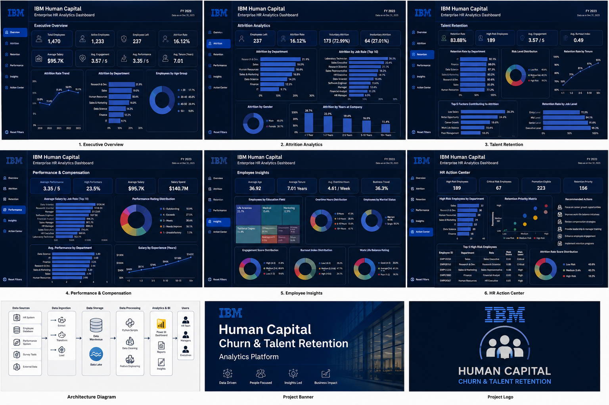

# 🚀 IBM Human Capital Churn & Talent Retention
### Enterprise HR Analytics Dashboard using Power BI

<p align="center">


</p>

---

# 📌 Overview

Employee attrition is one of the biggest challenges faced by modern organizations. High employee turnover increases recruitment costs, decreases productivity, and impacts organizational performance.

This project presents an **Enterprise HR Analytics Solution** built using the IBM HR Employee Attrition dataset. The dashboard helps HR teams identify employee churn patterns, monitor workforce health, analyze employee engagement, detect burnout risks, and prioritize retention strategies using interactive visual analytics.

The solution follows enterprise dashboard design principles inspired by consulting firms such as IBM Consulting, Deloitte, Accenture, and Microsoft.

---

# 🖥 Dashboard Preview

> Place your generated dashboard image in:

```
screenshots/img_02.png
```

Then display it using:

```markdown

```

---

# 🎯 Business Objectives

- Identify employees at high risk of attrition
- Analyze department-wise turnover
- Monitor workforce demographics
- Measure employee engagement
- Detect burnout indicators
- Evaluate promotion opportunities
- Compare compensation across departments
- Support HR leadership in making retention decisions

---

# 📊 Dashboard Pages

## 1️⃣ Executive Overview

- Workforce KPIs
- Attrition Rate
- Active Employees
- Average Salary
- Engagement Score
- High Risk Employees
- Executive Summary

---

## 2️⃣ Attrition Analytics

- Department Attrition
- Job Role Analysis
- Attrition by Age
- Attrition by Salary Band
- Overtime Analysis
- Business Travel Analysis
- Key Drivers of Attrition

---

## 3️⃣ Talent Retention

- Engagement Analysis
- Burnout Analysis
- Promotion Eligibility
- Manager Effectiveness
- Retention Priority
- Work-Life Balance

---

## 4️⃣ Compensation & Performance

- Salary Distribution
- Performance Tier
- Career Stage
- Promotion Analysis
- Monthly Income Analysis

---

## 5️⃣ Employee Insights

- Workforce Demographics
- Education Analysis
- Travel Analysis
- Experience Distribution
- Department Composition

---

## 6️⃣ HR Action Center

- High Risk Employees
- Attrition Risk Score
- Burnout Index
- Retention Recommendations
- Interactive Employee Table

---

# 📈 Key Performance Indicators

- Total Employees
- Active Employees
- Employees Left
- Attrition Rate
- Average Salary
- Average Age
- Average Tenure
- Average Engagement Score
- Burnout Index
- Attrition Risk Score
- Promotion Eligible Employees
- High Risk Employees

---

# 🛠 Feature Engineering

Additional business features were created to improve HR analytics capabilities.

- Attrition Risk Score
- Burnout Index
- Engagement Score
- Salary Band
- Performance Tier
- Promotion Eligibility
- Career Stage
- Retention Priority
- Manager Effectiveness Score
- Distance Category
- Experience Group
- Tenure Group

---

# 📂 Project Structure

```
IBM-Human-Capital-Churn-Talent-Retention
│
├── data
│   ├── IBM_HR_Data_Enterprise.csv
│   ├── Data_Dictionary.xlsx
│   └── Data_Cleaning_Report.pdf
│
├── notebooks
│   ├── EDA.ipynb
│   └── Feature_Engineering.ipynb
│
├── python
│   ├── preprocessing.py
│   ├── feature_engineering.py
│   └── eda.py
│
├── powerbi
│   ├── IBM_HR_Dashboard.pbix
│   ├── IBM_Theme.json
│   └── Enterprise_DAX_Measures.md
│
├── screenshots
│   └── dashboard_preview.png
│
└── README.md
```

---

# 📊 Dataset

- IBM HR Employee Attrition Dataset
- 1,470 Employees
- 50+ Features (including engineered features)

---

# 🧰 Technology Stack

- Power BI
- DAX
- Python
- Pandas
- NumPy
- SQL
- Git
- GitHub

---

# 📌 Business Insights

The dashboard enables HR leaders to:

- Detect departments with high attrition
- Identify employees at critical retention risk
- Monitor workforce engagement
- Analyze burnout trends
- Evaluate promotion effectiveness
- Compare salary distribution across business units
- Improve workforce planning

---

# 🚀 Future Enhancements

- Machine Learning based Attrition Prediction
- What-if Analysis
- Power BI Service Deployment
- Row Level Security
- Automated Data Refresh
- Azure SQL Integration

---

# 👨‍💻 Author

**Kunal Pramanik**

M.Sc. Data Science

GitHub: https://github.com/your-username

LinkedIn: https://linkedin.com/in/your-profile

---

## ⭐ If you found this project useful, consider giving it a Star!
